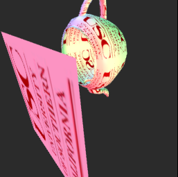
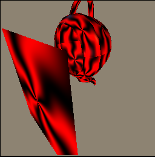

Here's the README file for the **Custom 3D Graphics Library**:

---

# Custom 3D Graphics Library

## Overview

This project involves the design and development of a **3D Graphics Library** built from scratch using **C/C++**. It implements essential graphics functionalities including rasterization, shading, texture mapping, and anti-aliasing, without relying on existing graphics frameworks.

## Features

- **Rasterization and Shading**: The library provides core functionalities for rendering 3D objects, including custom shading techniques such as **Phong** and **Gouraud shading**, which allow for smooth color transitions and realistic lighting effects.

- **Texture Mapping**: Implements texture mapping methods to apply textures onto 3D models, enhancing realism in rendered scenes.

- **Anti-Aliasing**: Built-in anti-aliasing techniques to reduce jagged edges and smooth the visual quality of rendered frames.

- **Geometric Transformations**: Supports 3D transformations such as scaling, rotation, and translation, which are applied to objects to simulate movement and changes in perspective.

- **Lighting Models**: Implements **Phong shading** for detailed lighting effects, as well as **Gouraud shading** for smoother color interpolation at the vertex level, improving performance while maintaining visual quality.

- **Texture Filtering**: Provides advanced texture filtering techniques such as **bilinear** and **trilinear** filtering to enhance the quality of textures at various distances from the camera.

## Optimizations

The graphics pipeline has been optimized to handle:

- **Object Transformations**: Efficiently applying transformations to 3D models to simulate movement, rotation, and scaling.
- **Perspective Corrections**: Accurate handling of perspective changes to ensure realistic depth representation.
- **Pixel-Level Operations**: Smooth interpolation of colors and pixel data, ensuring accurate color representation across rendered frames.

## How to Use

1. Clone the repository to your local machine.
2. Open this project in Microsoft Visual Studio.
3. Click on Run.

## Requirements

- A C/C++ compiler.
- Basic understanding of 3D graphics concepts (e.g., transformations, lighting models).

## Future Enhancements

- Support for additional lighting models and shading techniques.
- Further optimizations for rendering performance.
- Improved support for more complex 3D models and environments.

---

